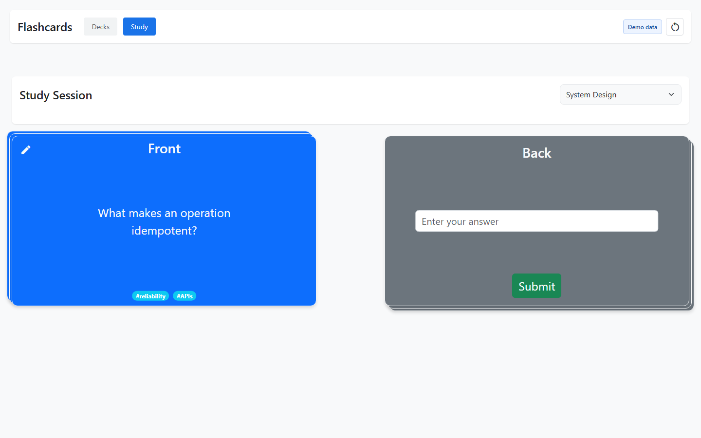
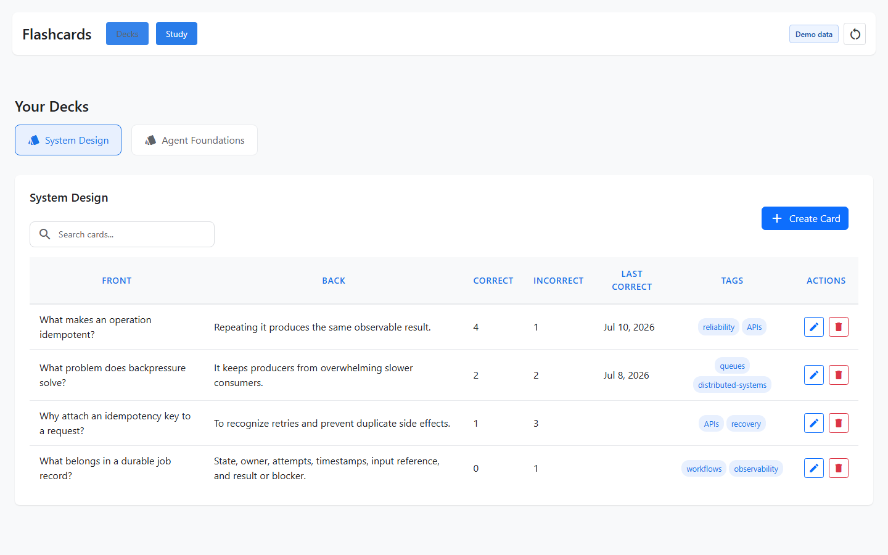

# Flashcards

An Angular study app for deck management, card editing, free-response study sessions, answer tracking, tags, and per-card performance history.

**[Open the public demo](https://jchronister2.github.io/Flashcards/)**

The public demo uses sample decks stored only in your browser. A self-hosted deployment can instead store decks in a Google Sheet owned by the signed-in user.

## Features

- Creates and manages flashcard decks as Google Sheets tabs.
- Adds, edits, and deletes cards.
- Runs free-response study sessions and tracks correct/incorrect counts.
- Remembers the most recently selected deck.
- Keeps the user's spreadsheet in their own Google Drive.

## Screenshots

The screenshots below use the public demo data. The reset button restores the original sample decks.

### Study session



### Deck manager



## Privacy

The application has no project-operated backend. The public demo does not load Google OAuth or call Google APIs. Its sample data and changes remain in browser local storage.

In a configured self-hosted deployment, OAuth tokens stay in browser local storage and flashcards are written directly to a Google Sheet in the signed-in user's Drive. Do not use authenticated mode on a shared browser profile.

## Google OAuth setup

This repository does not contain an API key or OAuth client ID.

1. Create a Google Cloud project and OAuth 2.0 Web Client.
2. Enable the Google Sheets API and Google Drive API.
3. Add your local and deployed origins to the OAuth client's authorized JavaScript origins.
4. Copy `src/assets/config.local.example.js` to `src/assets/config.local.js`.
5. Put your OAuth client ID in `config.local.js`.

`config.local.js` is ignored by Git. Google OAuth web client IDs are public identifiers, but keeping each deployment's value outside the repository makes setup and ownership explicit. No Google API key is required by the current implementation.

## Run locally

```powershell
npm install
npm start
```

Open `http://localhost:4200`.

## Verify

```powershell
npm run verify
```

This runs a production build, the headless browser test suite, and a production dependency audit.

## Data model

Each deck is a worksheet. Cards use columns for front, back, correct count, incorrect count, last-correct date, and comma-separated tags. The spreadsheet ID is stored in browser local storage after the first successful lookup or creation.

## License

MIT. See [LICENSE](LICENSE).
